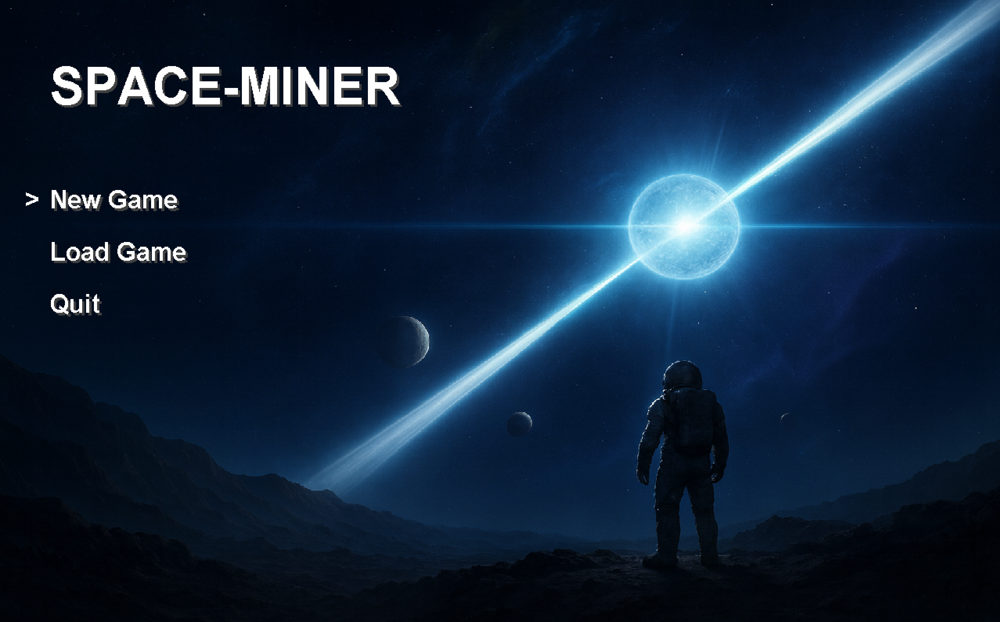

# 🌌 Space-Miner

> **Current Version:** Alpha 0.1.5
> **Developer:** Neal Kaushik Sharma

---

## 🪐 The Mission: PSR B1257+12

You are stranded. Your ship has crash-landed in the **PSR B1257+12 system**—a real-world star system orbited by a massive **Pulsar**.

The environment is hostile. Bathed in constant radiation from the dead star, oxygen is scarce, and the planet's surface is unforgiving. You must explore the grid, scavenge resources, and reconstruct your technology to survive the "Lich" star's gaze.

This is a game about **exploration**, **logistics**, and **survival** built entirely from scratch.

---

## 📸 Gallery

---

## 🎮 Key Features

### 🎒 Deep Inventory Management
Survival requires organization. The game features a complete **slot-based inventory system**.
* **Drag & Swap:** Organize your backpack efficiently.
* **Storage Containers:** Find chests scattered across the world to store excess materials.
* **Smart Transfer:** Instantly move items between your inventory and storage containers with a single click.

### 🗺️ Interactive World
The world isn't just a static background.
* **Precise Physics:** The game uses a custom collision system, allowing for smooth movement around obstacles rather than snapping to a rigid grid.
* **Context-Sensitive Actions:** Interact with specific objects in the world—open crates, pick up tools off the ground, or inspect machinery—dynamically based on where you are facing.

### ⚙️ Smooth Performance
* **High Refresh Rate:** Running on a custom game loop optimized for **144 FPS**, providing fluid character animations and responsive controls.
* **Save/Load System:** Your progress is persistent. Save your location, inventory, and world state and pick up exactly where you left off.
* **Custom Settings:** Adjust audio levels, toggle fullscreen, and manage controls via a persistent configuration menu.

---

## ⌨️ Controls

| Key | Action |
| :--- | :--- |
| **W, A, S, D** | Movement |
| **F** | **Interact** (Open Chests, Pick up items) |
| **E** | Open **Inventory** |
| **ESC** | Pause / Options Menu |
| **1 - 5** | Select Hotbar Slot |
| **Enter** | Confirm Selection |
| **F3** | Toggle Debug Overlay |

---

## 🧩 Tech Stack

This project is a showcase of **Native Java Development**. It was built without the use of external game engines (like Unity or Godot) to demonstrate core programming concepts.

* **Language:** Java (JDK 8+)
* **Rendering:** Java2D (Swing + AWT)
* **Architecture:** Custom Entity-Component-style system
* **Data Persistence:** File I/O for saving world states and configurations

---

## 🧰 Roadmap

The foundation is complete. The following features are in active development:

- [ ] **Oxygen & Hunger Systems:** Survival mechanics tied to the harsh environment.
- [ ] **Crafting UI:** Combine resources to repair your ship.
- [ ] **Combat:** Hostile alien fauna.
- [ ] **Procedural Generation:** Randomly generated planetary biomes.
- [ ] **Weather:** Radiation storms and day/night cycles.

---

## 🪙 Credits

* **Development:** Neal Kaushik Sharma
* **Assets:** Custom pixel art and placeholder assets.

---

### ⚠️ Note
*This project is currently in active development. Features are subject to change and optimization.*